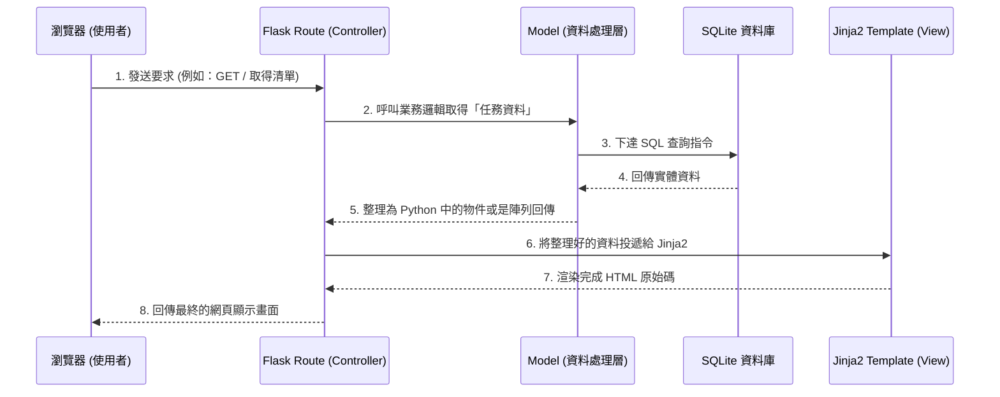

# 任務管理系統 - 系統架構設計

## 1. 技術架構說明

本專案採用伺服器端渲染 (Server-Side Rendering, SSR) 的網頁應用程式架構，並以 Python 生態系中最輕量的網站框架 Flask 作為核心開發工具。

**核心技術選型與原因：**
- **後端框架：Flask** (Python) 
  - *原因*：輕量、易上手且高度彈性，非常適合用來快速開發 MVP 產品。
- **模板引擎：Jinja2** (搭配前端 HTML/CSS)
  - *原因*：為 Flask 內建支援。開發者能直接把資料透過 Jinja2 語法動態注入於 HTML 中，讓伺服器直接產生網頁，免去了建置龐大前端框架 (如 React) 的學習與維護成本。
- **資料庫：SQLite**
  - *原因*：輕量型關聯式資料庫系統。它沒有繁瑣的伺服器環境設定需求，所有資料都儲存於一個簡單的本地檔案中，非常適合中小規模系統與開發階段快速原型製作。

**MVC 模式在此專案的運作：**
- **Model (模型)**：定義資料表長什麼樣子，負責與 SQLite 資料庫互動（儲存新任務、讀取任務列表等邏輯處理）。
- **View (視圖)**：負責最終畫面的呈現，由 Jinja2 與 HTML 標籤組合而成，負責把後端產出的資料變得具體可見。
- **Controller (控制器)**：由 Flask Route 擔任。它是接收使用者行為（如點擊按鈕、提交表單）的入口點，負責呼叫 Model 取資料，最後把結果交給 View 渲染為最後的畫面向使用者顯示。

## 2. 專案資料夾結構

專案採用具有適當模組劃分的資料夾結構，便於日後擴充維護：

```text
web_app_development/
├── app/
│   ├── models/              ← 資料庫模型 (Model)
│   │   └── task_model.py    ← 定義 Task 的資料對應與操作邏輯
│   ├── routes/              ← Flask 路由控制器 (Controller)
│   │   └── task_routes.py   ← 處理 /任務 的各項請求 (如增刪改查)
│   ├── templates/           ← Jinja2 HTML 模板 (View)
│   │   ├── base.html        ← 共用版型母版（例如包含整站 CSS 與 Header）
│   │   └── index.html       ← 首頁與主要任務清單畫面
│   └── static/              ← 網頁靜態資源
│       └── css/
│           └── style.css    ← 系統共用預先定義樣式
├── instance/
│   └── database.db          ← 系統運作時實際使用的 SQLite 資料庫檔案
├── docs/                    ← 系統需求與設計文件目錄
│   ├── PRD.md
│   └── ARCHITECTURE.md
├── app.py                   ← 專案主程式入口點 (負責初始化並掛載路由)
└── requirements.txt         ← 記錄依賴套件與版本清單
```

## 3. 元件關係圖

以下展示系統在處理一筆請求時（如使用者瀏覽首頁），各個層級的互動關係：



## 4. 關鍵設計決策

1. **集中採用伺服器主導的開發模式 (SSR)**
   - *決策*：完全透過 Flask 後端進行路由與模板轉換。不會撰寫大量的 JavaScript API Client 邏輯來與後端拉資料。
   - *原因*：相較於前後端分離的架構，此模式能夠顯著縮短這類 CRUD (增刪改查) 系統的開發時間，而且伺服器給出完整畫面也對剛起步的產品更單純好抓 Bug。

2. **利用 `instance/` 資料夾儲存資料庫檔案**
   - *決策*：我們特意將 `database.db` 脫離專案原本的資料夾，放至獨立生成的 `instance/` 結構中。
   - *原因*：避免未來套用 Git 版本控制時，不小心將機敏的測試資料或使用者資訊推上 GitHub，這是 Flask 內建保護重要資料的良好實踐。

3. **藍圖模式 (Flask Blueprints) 的準備**
   - *決策*：將與「任務」相關的請求單獨放到 `app/routes/task_routes.py` 內進行邏輯撰寫，由主程式 `app.py` 動態引用。
   - *原因*：不將一切內容塞死在一支主程式發熱發脹。若是將來需求改變，想擴充諸如「會員模組」、「報表功能」等都會相當直覺清晰。

4. **採用 `base.html` 版塊繼承**
   - *決策*：在 View (Jinja2) 方面不會每一頁都去寫 HTML `<html><head>...</head>` 框架，而是透過 `` 的作法。
   - *原因*：大幅度減少多頁切換時複製貼上的問題。我們僅需設定一份 `base.html`，日後改網站配色、加通用字體、改排版都只需要動一支檔案即可。
