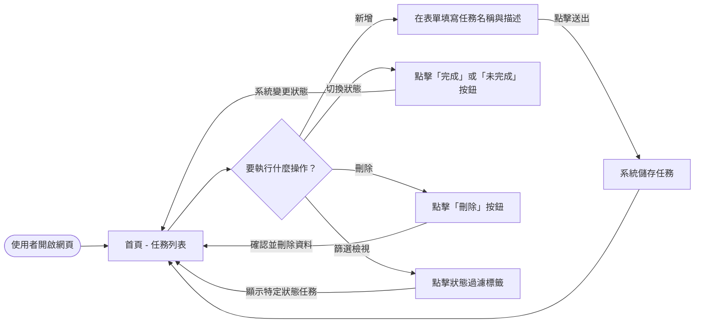
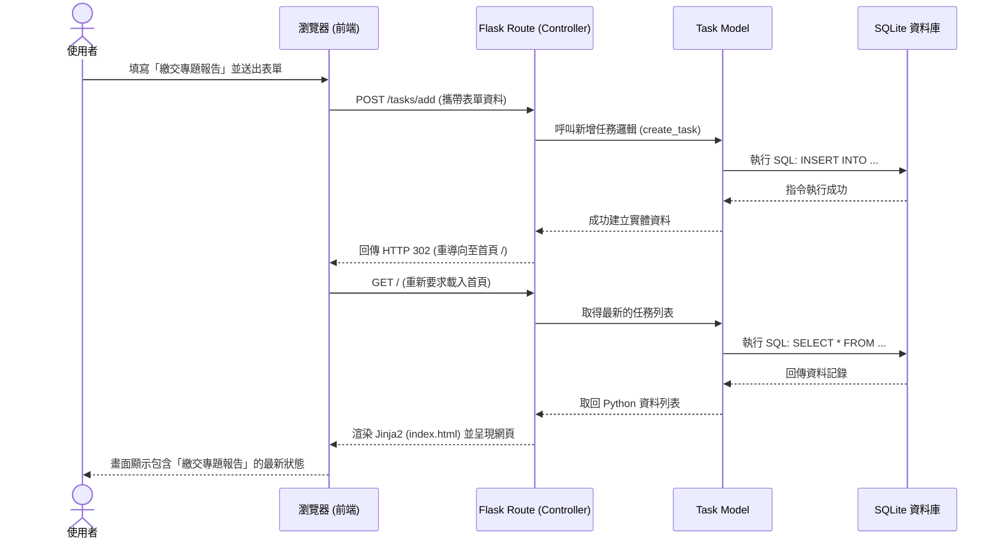

# 任務管理系統 - 流程圖與資料流

本文件基於 PRD 的需求與既定系統架構，使用 Mermaid 語法繪製了「使用者操作動線」與「核心功能的系統運作序列圖」，並提供初步的路由 (Routes) 路徑對照表。這將有助於確保開發實作不會脫離原本產品設計的預期。

## 1. 使用者流程圖 (User Flow)

此流程圖描述使用者進入網站後，在各個任務互動功能之間的完整操作路徑。

## 2. 系統序列圖 (Sequence Diagram)

此序列圖進一步展示當使用者執行**「填寫表單並新增任務」**操作時，瀏覽器、Flask、資料處裡層 (Model) 與 SQLite 資料庫之間的完整溝通流程。

## 3. 功能清單對照表

根據 PRD 需求與上述流程，我們先簡單盤點系統中所需要的操作路徑 (URL Routing)。

| 功能名稱 | HTTP 方法 | URL 路徑 | 注意事項 / 處理邏輯 |
|---|---|---|---|
| 查看任務清單 | `GET` | `/` | 渲染首頁列表（可透過 `?status=completed` 等參數進行篩選）。 |
| 新增任務 | `POST` | `/tasks/add` | 接收入力資料 (Form Data)，建立後自動導回首頁。 |
| 切換完成狀態 | `POST` | `/tasks/<task_id>/toggle` | 用於勾選 / 取消勾選已完成的任務，並自動導回首頁。 |
| 刪除任務 | `POST` | `/tasks/<task_id>/delete` | 接收刪除請求並操作 DB，保護性質強的刪除行為避免用 GET 發動。 |

> **設計考量**：因為本專案技術環境為純 Flask 搭配 SSR（伺服器端渲染，不依賴龐大的 JavaScript AJAX 與前端路由），所有的操作在處理完邏輯後，皆直接透過 HTTP 重導向（Redirect）刷新使用者的畫面。
